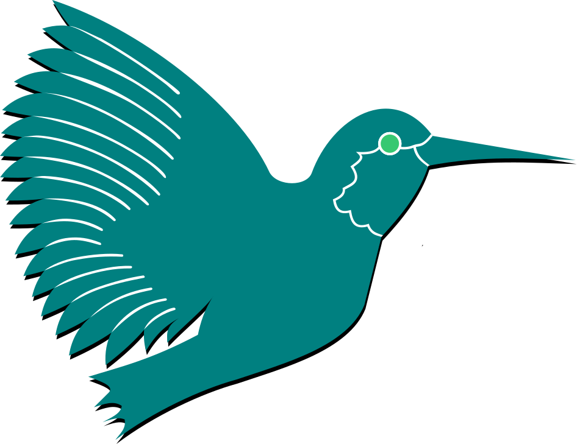

# Byczax

_[Computer Science](https://weka.pwr.edu.pl/) student at [WUST](https://pwr.edu.pl/en/)_

_I like learning new stuff, it doesn't have to be related with IT_

_yes, this pixel art was done by me_

## Some statistics about me

<!--  -->
<!--  -->

<!--  -->

## <!--  -->

<!-- ### Working with

#### Languages

#### IDE:

 -->

<!--  -->
<!--  -->
<!--  -->

  

